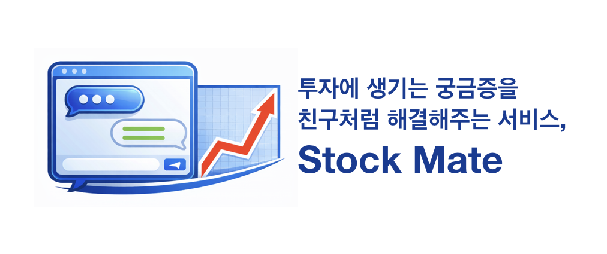
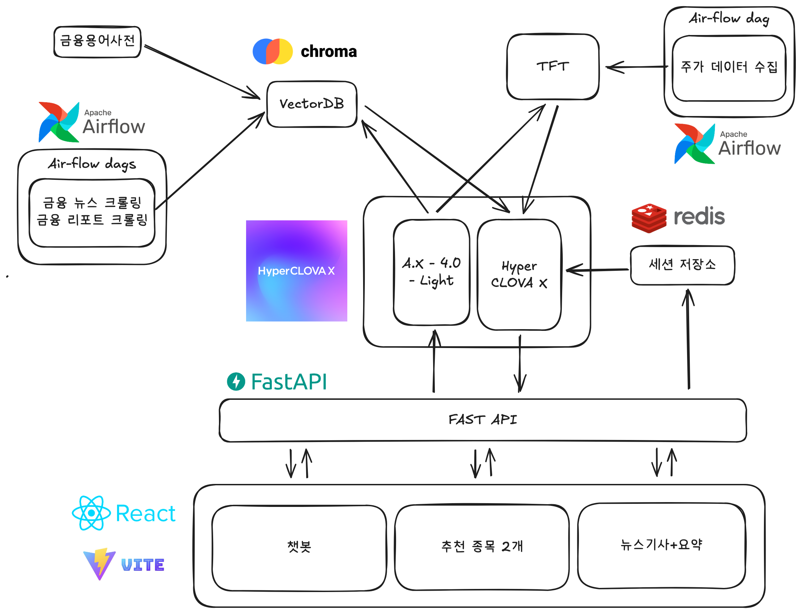
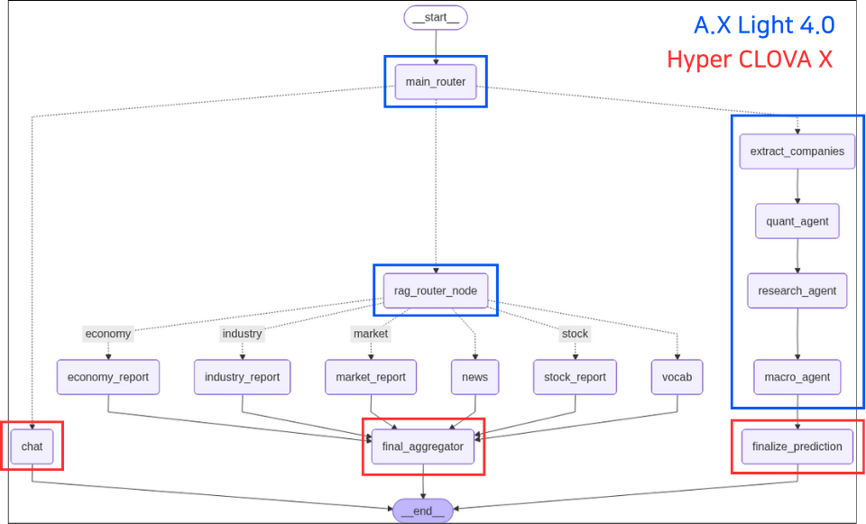

# Stock Mate - Team 완주

## 프로젝트 소개

### 프로젝트 배경 및 목적

---

> 초보 투자자가 자연어 질의를 통해 투자 정보를 쉽고 직관적으로 획득할 수 있는 AI 기반 금융 정보 제공 서비스

- 사람들에게 실질적인 도움을 줄 수 있는 AI 기술 활용 사례를 개발하고, 최신 정보 반영이 가능한 LLM 기반 서비스의 설계 및 구현 경험을 쌓고자 본 주제를 선정하였습니다. 특히 금융 정보 접근성이 낮은 초보 투자자들을 효과적으로 지원하는 데 초점을 맞추었습니다.

### 프로젝트 구현 방향

---

- A.X-4.0-Light 와 Hyper CLOVA X 활용하여 뉴스 기사, 금융 용어, 금융 리포트 등 다양한 금융 데이터를 종합 분석하고, 이를 바탕으로 챗봇 형태의 대화형 답변을 제공합니다. 또한, 이미 수집된 뉴스 기사와 요약 정보를 함께 제공하여 사용자가 보다 쉽게 투자 정보를 이해할 수 있도록 합니다. 더불어, 하루에 2개의 추천 종목을 제공하여 초보 투자자가 시장 흐름을 파악하고 합리적인 투자 판단을 내릴 수 있도록 지원하는 기능도 포함되어 있습니다.
- TFT(Temporal Fusion Transformer) 모델을 KOSPI200 종목을 대상으로 향후 3거래일 동안의 주가를 예측하도록 학습시켰습니다. 서비스 사용자는 채팅을 통해 모델이 예측한 가격 범위를 알 수 있으며, 메인 화면에서는 2개의 종목을 추천하는 기능도 구현되어 있습니다.

## 프로젝트 아키텍처

### 전체 시스템 아키텍처

---

### Multi-Agent 시스템 아키텍처

---

| 요소 | 설명 |
|-----|-----|
| Main Router | 사용자의 질문 유형을 분류하여 3가지 경로 중 하나를 선택, 최적화된 답변 제공 |
| Rag Router | 6개의 데이터베이스 중 적합한 소스를 복수 선택하여 답변의 정확도와 품질 향상 |
| Prediction (Multi Agent System) | 다중 에이전트 구조를 통해 데이터 소스를 분리·전문화 |

## 팀원 소개

| 팀원 이름 | 소개 |
|-----|-----|
| 황연하 | **팀장**, 프로젝트 기획, baseline 코드 작성, 프론트엔드 / 백엔드 구현, 데이터 수집, 코드 리뷰, 피드백, GitHub 협업 환경 구축, Wrap-up report 및 발표 자료 초안 작성 |
| 홍용훈 | Agent 시스템 설계, 데이터 수집 및 생성, RAG, 모델 학습 및 양자화 시도 |
| 이성연 | 주가 데이터 수집, 기술 지표 선정 및 계산, 시계열 모델 학습, 종목 추천 파이프라인 설계 |

설치 - py310
source /data/ephemeral/home/py310/bin/activate
chmod +x install-py310.sh
./install-py310.sh

vLLM 실행
vllm serve skt/A.X-4.0-Light \
--trust-remote-code \
--dtype half \
--quantization bitsandbytes \
--max-model-len 8192 \
--gpu-memory-utilization 0.7 \
--port 8001

fastAPI 실행
python -m uvicorn src.main:app --host 127.0.0.1 --port 8000 --reload

redis 실행
service redis-server start

설치 - airflow
source /data/ephemeral/home/py310-airflow/bin/activate
chmod +x airflow.sh
./airflow.sh

airflow 실행
./scripts/run_airflow.sh

frontend 실행
npm install react-markdown
npm i lucide-react
npm run dev

필요한 파일
시사경제용어사전.xlsx
통계용어사전.xlsx
kospi200_merged_2021_2025_updated.csv

필요한 키/토큰
CLOVA_STUDIO_API_KEY
한국투자증권 API KEY
Hugging face token
